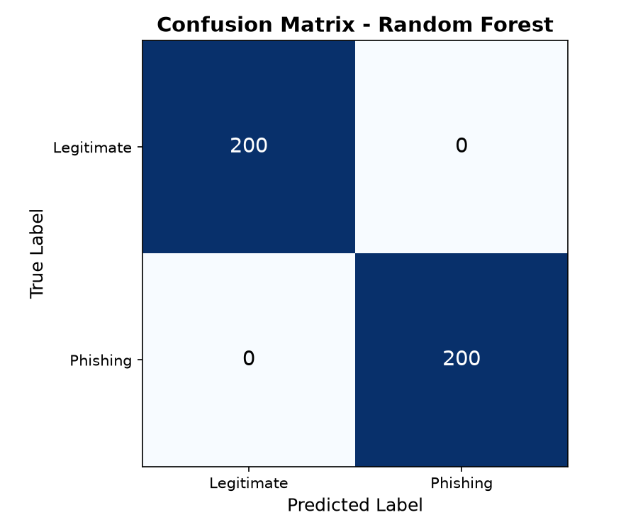
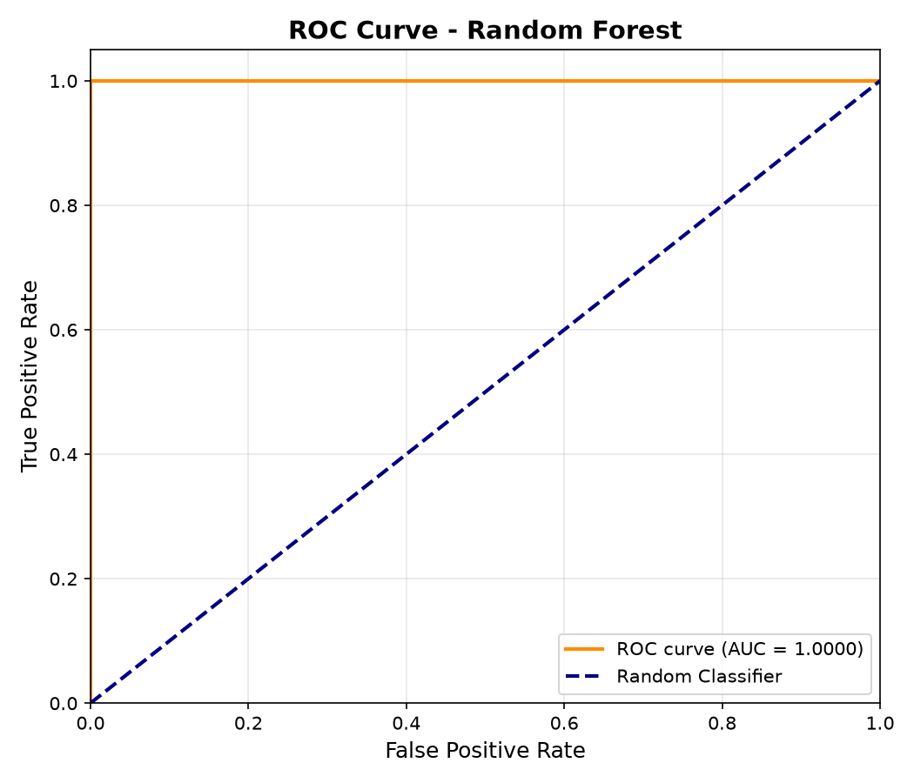

# Phishing Email Detection Model

A Machine Learning-based phishing email detection system built using Scikit-learn. The model analyzes email text, URLs, and phishing-related keywords to classify emails as either **Phishing** or **Safe**.

---

## Features

- Email preprocessing and cleaning
- URL and keyword feature extraction
- TF-IDF text vectorization
- Random Forest classification
- Phishing/Safe prediction
- Accuracy, Precision, Recall, and F1 evaluation
- Confusion Matrix visualization
- ROC Curve analysis
- Custom email prediction support

---

## Technologies Used

- Python 3
- Scikit-learn
- Pandas
- NumPy
- NLTK
- Joblib
- TLDExtract
- Python-WHOIS

---

## Project Structure

```text
PhishingEmailDetection/
├── data/
├── models/
├── netsparkles/
├── src/
├── main.py
└── requirements.txt
```

---

## Installation

```bash
pip install -r requirements.txt
```

---

## Training the Model

```bash
python main.py --samples 2000 --model random_forest
```

---

## Predicting an Email

```bash
python -m src.predict "URGENT: Your account has been compromised! Click here http://bit.ly/3xK9mN2"
```

---

## Results

### Model Performance

| Metric | Score |
|---------|--------|
| Accuracy | 100% |
| Precision | 100% |
| Recall | 100% |
| F1 Score | 100% |
| AUC-ROC | 100% |

---

## Confusion Matrix



---

## ROC Curve



---

## Sample Predictions

### Phishing Email

**Input**

```text
URGENT: Your account has been compromised!
Click here http://bit.ly/3xK9mN2
```

**Output**

```text
PHISHING (96% Confidence)
```

### Legitimate Email

**Input**

```text
pro.aiml.prm21@gmail.com
```

**Output**

```text
LEGITIMATE (85.12% Confidence)
```

---

## Author

**Nishitha**  
Cybersecurity & AI/ML Internship Project
